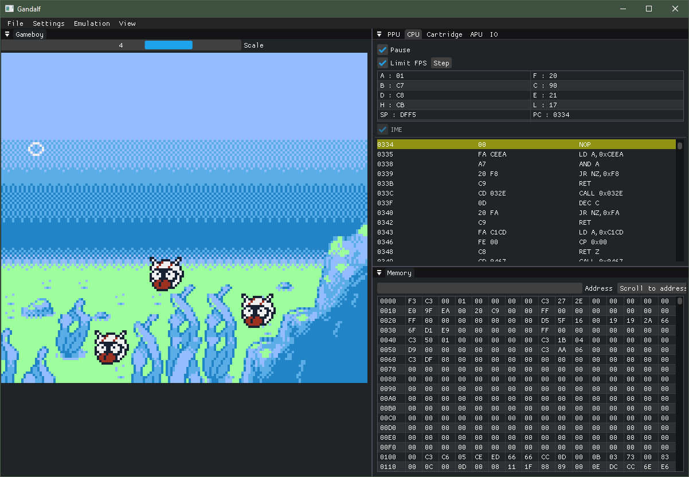
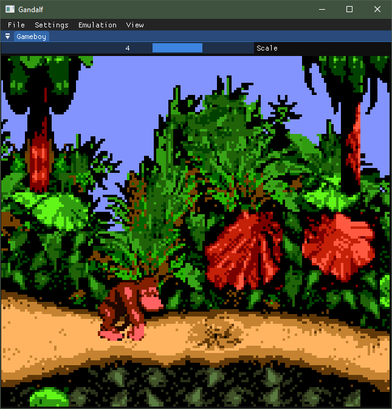

# Gandalf

A Gameboy color emulator with debugging tools.

Work in progress. If you want to play Gameboy games I recommend finding a better emulator.

## Building
Clone the repository and its submodules

```
git clone --recurse-submodules https://github.com/stan-roelofs/Gandalf.git
```

Generate the build system files using cmake

```
mkdir build
cd build
cmake .. -DCMAKE_BUILD_TYPE=Release
```

Now build the code
```
cmake --build .
```

If you are building on Windows using MSVC: 
```
cmake --build . --config Release
```

Note: OpenGL needs to be installed in order to compile. 
Note: Compiling as Release or RelWithDebInfo is recommended. The STL containers used by the emulator can be extremely slow in Debug mode because of iterator debugging. 

## Accuracy
The emulator is fairly accurate, passing the majority of test ROMs. The PPU implementation requires work, but finding accurate documentation is difficult. 

## Preview


